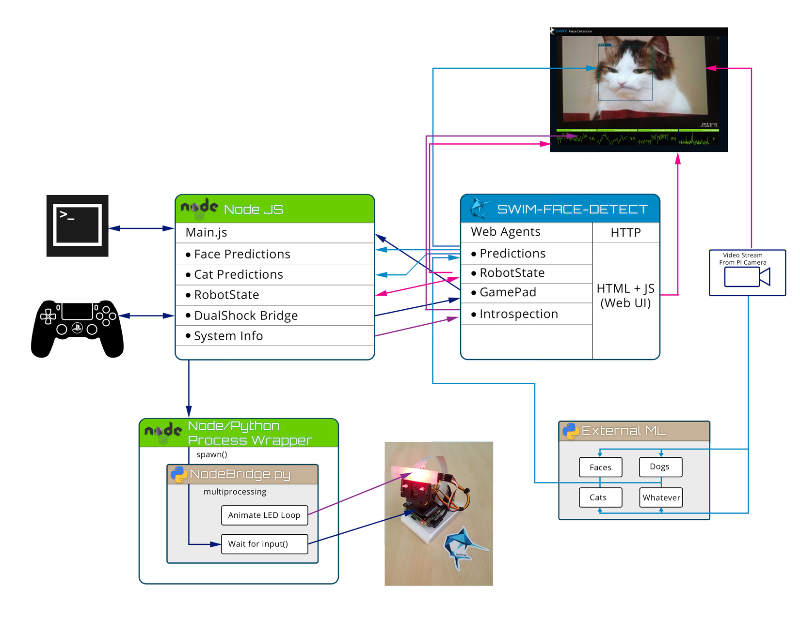

# Swim ML Example

## Overview
This example aims to demonstrate how to create an appication made up of many distrubted individual processes which enable disparate processes to share data in real time and act upon that data. Swim eliminates the need to get down and dirty with databases, message queues, or data replication as it handles all that for you and does it in a way which makes the resulting data highly sharable between processe, be it on the local device or in the cloud. This way more time can be spent writing things to act upon the data instead of spending time maintaining and shuffling data around.

This example uses Swim services and web agents on the server. The web agents are what store and stream all of the various values and data which drives the application. 

NodeJS acts as the main controller and orchestrates all the various processes in order to enable the the various actions the bot can do. Node also has a python wrapper classes which cna spawn child processes written in Python and communicate back and forth to each python process. This allows teh app to use teh native Python Libraries for communicating with the servos and LEDs and do it in a non-blocking way.

The Web UI is served from Swim over port 9001. The web UI is just a simple HTML page using vanilla Javascript and Swim UI Components to show in real time the current state, performance analytics, and prediction results all in the same screen and all served up by Swim.

## Hardware
This example uses a Pimoroni Tilt/Pan Hat on a standard Raspberry Pi. The camera is mounted to the end of the tilt pan mount. Additionally there is a 8 pixel NeoPixel strip mounted above the camera.
A full build list and instructions can be found on [Hackster.io](https://www.hackster.io/scott-clarke/twitchy-the-tilt-pan-bot-9fbea1)

## Software
* **Swim** - In this demo Swim is responsible for maintaining the current state of the bot as well and streaming back out all the various incoming data sources the project has.
* **NodeJS** - This runs alongside Swim and is responsible for taking actions based on the current state of the bot based on the data provided to it from Swim. For example, the bot's mood is based on node counting the number of cats vs human faces in the ML predictions and setting mood (back in swim) based on those counts. Node is also able to spawn child processes writing in Python. This is used for two way communication with the Hat in order to set servo posistion or LED animation state.
* **Python** - In some cases it is better to use python then javascript, such as talking to hardware or running ML.
* **[OpenCV Harr Cascades](https://github.com/opencv/opencv/tree/master/data/haarcascades)** - There are a number of sample datasets with are provided by OpenCV which we are utilizing for this demonstration.
* **[Motion](https://motion-project.github.io/index.html)** - Easily configured and open source software which handles streaming the video signal from a Pi Camera or webcam.
* **[node-dualshock-controller](https://github.com/rdepena/node-dualshock-controller)** - Open source 3rd party lib which enables communication with PS3 or PS4 controller over bluetooth

## Data Flow Diagram
This diagrams shows the various paths between process which data takes in order to enable each process to be run in a modular fashion so each process can run in the best place for it such as doing ML on dedicated hardware.
<section id="content">
    
<section>

<!-- ## Set-up

* pull from github
* npm build
* set configs

## Running

* run gradle from server
* run node from node
* run ML from where ever
* see results in browser (9001) -->

